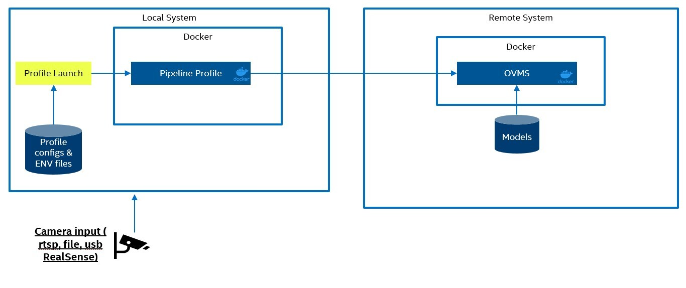

# Distributed Architecture

<!--ts-->

- [Status](#status)
- [Decision](#decision)
- [Context](#context)
- [Proposed Design](#proposed-design)
- [Consequences](#consequences)
- [References](#references)

<!--te-->

## Decision

<!-- Requirements approval board will update this section with justification for approval or rejection -->

## Context  

<!-- Please provide context to the requirement. -->

To a wider variety of computer vision use cases in the real world a distributed inference architecture is required for deployment and scale. To achieve this, OpenVINO Model Server (OVMS) will be used for server side inferencing as part of the architecture design. The new architecture will lose some inference throughput but gain flexibility and scale.

## Proposed Design 

<!-- Please provide a high level design of the proposed requirement. -->

Using OpenVINO Model Server (OVMS) pipeline, workloads can be distributed between different services. For our solution a single system and remote server setup will be supported.

### Single System Setup

The single system solution will launch both the OVMS client and OVMS server on the same system as Docker containers. The local network can be used for communication between the Docker containers. The profile launcher program will load the profile configs and environment variables form a local data volume. The computer vision models will also be located on a local data volume. The models can be downloaded using the provided scripts or manually by the user.

### Remote Server Setup

The remote serve set will launch the same OVMS client and OVMS server containers but on two different systems. These systems can be on the same network on in remote locations as long as the systems can communicate through the network. This will require additional security or a direct connection from client to server. Similar to the single system the profile launcher will load the profile configs and environment variables from a data volume. In this case the data volume can be a local copy or a remote copy of those files. On the server the computer vision models will be in a data volume. Unlike the profile config and environment files these must be located on the server in a data volume. This is to prevent any unwanted changes to the computer vision model when it is located in a remote location. 

### Running the Pipeline

The profile launching program will start a pre-configured OVMS client and OVMS server. [Run Pipeline](https://intel-retail.github.io/automated-self-checkout/OVMS/pipelinerun.html) documentation covers the parameter details and how to configure different input sources.

## Applicable Repos

[automated-self-checkout](https://github.com/intel-retail/automated-self-checkout)

## Consequences

<!-- Please provide a description of what consequences this requirement will have on the project. This includes breaking and non-breaking changes to all microservices -->

Unlike DLStreamer there will be some latency to call OVMS through gRPC. This will results in a slightly lower stream density for systems. We will however support a wider range and combination of models since the inferencing will be abstracted into the OpenVINO Model Server.

## References

<!-- [link](requirements-review-process.md) - useful links for the design -->

https://docs.openvino.ai/2023.0/ovms_what_is_openvino_model_server.html
https://github.com/openvinotoolkit/model_server