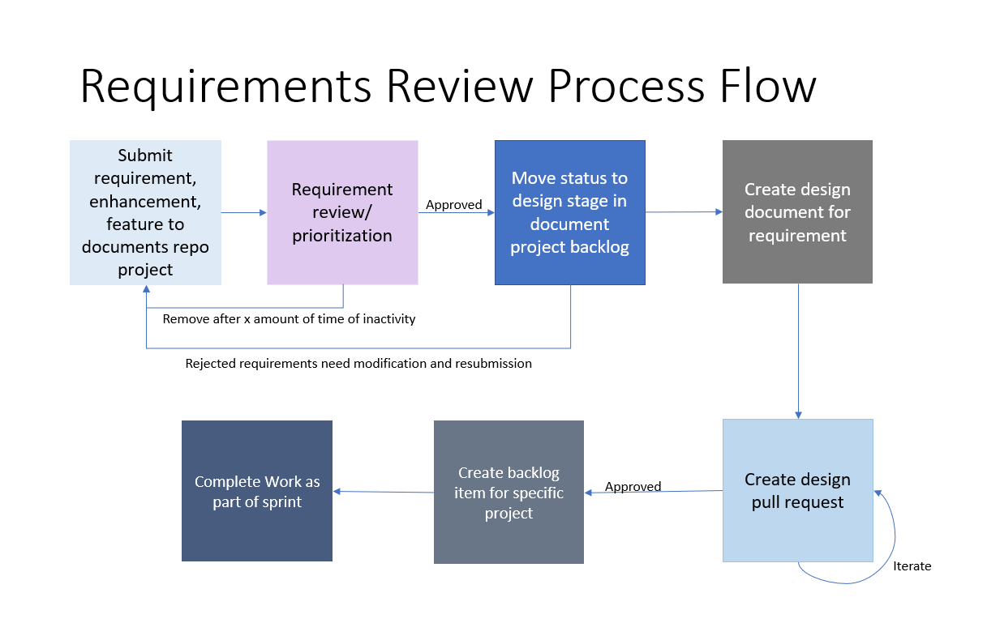

# Intel Retail Documentation Repository

## Requirements Process Breakdown

- Submit a github issue and follow the requirements template.

- Once a every (x) weeks there will be a requirements review meeting where we will approve, reject, or ask for modification to the requirement.

- If approved then the requirement will be moved into the design stage in the documents project.

- A detailed design document will be made by the submitter and development team.

- A pull request will be created and reviewed by the design review team. The design will be iterated until approved by the board.

- Once approved a story will be created in the appropriate github project and prioritized by the product owner.

- Story work will be completed based on the prioritization.