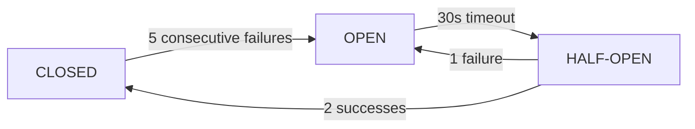

# How It Works

This document provides a comprehensive technical overview of the system architecture, component interactions, data flows, and design decisions.

## System Architecture

### High-Level Architecture

```text
┌─────────────────────────────────────────────────────────────────────────────┐
│                           DINE-IN ORDER ACCURACY                            │
├─────────────────────────────────────────────────────────────────────────────┤
│                                                                             │
│  ┌─────────────┐      ┌──────────────────┐      ┌─────────────────────┐    │
│  │             │      │                  │      │                     │    │
│  │  Gradio UI  │─────▶│   FastAPI API    │─────▶│   Validation        │    │
│  │  (Port 7861)│      │   (Port 8083)    │      │   Service           │    │
│  │             │      │                  │      │                     │    │
│  └─────────────┘      └────────┬─────────┘      └──────────┬──────────┘    │
│                                │                           │               │
│                                │                           │               │
│                    ┌───────────┴───────────┐               │               │
│                    │                       │               │               │
│                    ▼                       ▼               ▼               │
│           ┌────────────────┐     ┌─────────────────┐ ┌───────────────┐    │
│           │                │     │                 │ │               │    │
│           │  VLM Client    │     │ Semantic Client │ │ Metrics       │    │
│           │  (Circuit      │     │ (Circuit        │ │ Collector     │    │
│           │   Breaker)     │     │  Breaker)       │ │               │    │
│           │                │     │                 │ │               │    │
│           └───────┬────────┘     └────────┬────────┘ └───────────────┘    │
│                   │                       │                               │
└───────────────────┼───────────────────────┼───────────────────────────────┘
                    │                       │
                    ▼                       ▼
          ┌─────────────────┐     ┌─────────────────┐
          │                 │     │                 │
          │   OVMS VLM      │     │   Semantic      │
          │   (Qwen2.5-VL)  │     │   Service       │
          │   Port 8000     │     │   Port 8080     │
          │                 │     │                 │
          └─────────────────┘     └─────────────────┘
```

### Request Flow

```text
┌──────────┐    ┌─────────┐    ┌──────────┐    ┌─────────┐    ┌──────────┐
│  Staff   │    │ Gradio  │    │ FastAPI  │    │  VLM    │    │ Semantic │
│  Trigger │    │   UI    │    │   API    │    │ Client  │    │  Client  │
└────┬─────┘    └────┬────┘    └────┬─────┘    └────┬────┘    └────┬─────┘
     │               │              │               │              │
     │ Select Image  │              │               │              │
     │──────────────▶│              │               │              │
     │               │              │               │              │
     │ Click Validate│              │               │              │
     │──────────────▶│              │               │              │
     │               │              │               │              │
     │               │ POST /validate               │              │
     │               │─────────────▶│               │              │
     │               │              │               │              │
     │               │              │ Preprocess    │              │
     │               │              │ Image         │              │
     │               │              │───────────────│              │
     │               │              │               │              │
     │               │              │ analyze_plate()              │
     │               │              │──────────────▶│              │
     │               │              │               │              │
     │               │              │               │ OVMS POST    │
     │               │              │               │─────────────▶│
     │               │              │               │              │
     │               │              │               │◀─────────────│
     │               │              │               │ Detected Items
     │               │              │◀──────────────│              │
     │               │              │               │              │
     │               │              │ match_items()                │
     │               │              │─────────────────────────────▶│
     │               │              │                              │
     │               │              │◀─────────────────────────────│
     │               │              │            Similarity Scores │
     │               │              │               │              │
     │               │◀─────────────│               │              │
     │               │ Validation Result            │              │
     │◀──────────────│              │               │              │
     │ Display Results              │               │              │
     │               │              │               │              │
```

### Docker Services

| Container                 | Image                                   | Ports      | Description                         |
| ------------------------- | --------------------------------------- | ---------- | ----------------------------------- |
| `dinein_app`              | `intel/order-accuracy-dine-in:2026.0.0` | 7861, 8083 | Main application (Gradio + FastAPI) |
| `dinein_ovms_vlm`         | `openvino/model_server:latest-gpu`      | 8002       | Vision-Language Model server        |
| `dinein_semantic_service` | `intel/semantic-search-agent:1.0.0`     | 8081, 9091 | Semantic text matching              |
| `metrics-collector`       | `intel/hl-ai-metrics-collector:1.0.0`   | 8084       | System metrics aggregation          |

### Network Topology

```text
┌─────────────────────────────────────────────────────────────────┐
│                     Docker Network: dinein-net               │
│                                                                 │
│  ┌─────────────────┐    ┌─────────────────┐                    │
│  │   dinein_app    │    │ dinein_ovms_vlm │                    │
│  │                 │    │                 │                    │
│  │  - Gradio:7861  │───▶│  - REST: 8000   │  (internal)        │
│  │  - API:8083     │    │  - Host: 8002   │  (external)        │
│  │                 │    │                 │                    │
│  └────────┬────────┘    └─────────────────┘                    │
│           │                                                     │
│           │             ┌─────────────────┐                    │
│           │             │ semantic_service│                    │
│           └────────────▶│                 │                    │
│                         │  - REST: 8080   │  (internal)        │
│                         │  - Host: 8081   │  (external)        │
│                         └─────────────────┘                    │
│                                                                 │
│  ┌─────────────────┐                                           │
│  │metrics-collector│                                           │
│  │  - REST: 8084   │◀────── Prometheus-style metrics           │
│  └─────────────────┘                                           │
│                                                                 │
└─────────────────────────────────────────────────────────────────┘
                    │
                    ▼ Host Network
        ┌───────────────────────┐
        │   localhost:7861      │  ← Gradio UI
        │   localhost:8083      │  ← REST API
        │   localhost:8083/docs │  ← Swagger Docs
        │   localhost:8002      │  ← OVMS VLM
        │   localhost:8084      │  ← Metrics API
        └───────────────────────┘
```

---

## Component Details

### 1. VLM Client (`vlm_client.py`)

The VLM Client handles communication with OpenVINO Model Server for visual inference.

**Features:**

- **Image Preprocessing**: Smart resizing (672px max), JPEG compression (82% quality), contrast enhancement
- **Circuit Breaker**: 5 failures → OPEN, 30s recovery → HALF_OPEN, 2 successes → CLOSED
- **Connection Pooling**: Shared `httpx.AsyncClient` with HTTP/2, 50 max connections
- **Inventory-Aware Prompts**: Includes known menu items for improved accuracy

```python
# Circuit Breaker States
class CircuitState(Enum):
    CLOSED = "closed"      # Normal operation
    OPEN = "open"          # Failing, reject requests
    HALF_OPEN = "half_open"  # Testing recovery
```

### 2. Semantic Client (`semantic_client.py`)

Handles fuzzy string matching for item comparison.

**Features:**

- **Similarity Threshold**: Default 0.7 (70% match required)
- **Fallback Matching**: Exact string match when service unavailable
- **Circuit Breaker**: 15s recovery timeout (faster than VLM)
- **Connection Pool**: Shared client with 20 max connections

### 3. Validation Service (`validation_service.py`)

Orchestrates the validation workflow using Strategy pattern.

**Validation Pipeline:**

1. VLM inference → detected items
2. Semantic matching → item correlations
3. Quantity analysis → mismatches
4. Accuracy calculation → final score

```python
# Accuracy Calculation
accuracy = matched_items / max(expected_items, detected_items)
order_complete = (missing == 0) and (quantity_errors == 0) and (extra == 0)
```

### 4. Configuration Manager (`config.py`)

Thread-safe singleton for application configuration.

**Features:**

- Double-checked locking pattern
- Environment variable driven
- Runtime benchmark mode toggle

### 5. API Layer (`api.py`)

FastAPI endpoints with bounded validation cache.

**Features:**

- **BoundedValidationCache**: LRU eviction, 10K max entries
- **Thread-safe service init**: Lock-protected lazy initialization
- **Async metrics collection**: Non-blocking system stats

---

## Data Flow

### Validation Request Processing

1. **Image Processing**:
   Raw Image → Auto-Orient → Resize (672px) → Enhance → Sharpen → JPEG Compress (82%) → Base64 Encode

2. **VLM Inference**:
   Prompt: "Analyze this food plate image..." + Inventory list for context → OVMS POST `/v3/chat/completions` → Parse JSON response for detected items

3. **Semantic Matching**:
   For each expected item:
   - Find best match in detected items (similarity > 0.7)
   - Track: matched, missing, extra, quantity mismatches

4. **Result Aggregation**:

   ```text
   {
     "order_complete": true/false,
     "accuracy_score": 0.0-1.0,
     "missing_items": [...],
     "extra_items": [...],
     "metrics": { "latency": [...], "tps": [...], "utilization": [...] }
   }
   ```

### Metrics Collection

```text
┌─────────────────────────────────────────────────────────────────────┐
│                        METRICS PIPELINE                             │
├─────────────────────────────────────────────────────────────────────┤
│                                                                     │
│  VLM CLIENT                    METRICS COLLECTOR                   │
│  ┌────────────────┐           ┌────────────────┐                   │
│  │ log_start_time │──────────▶│ Start Timestamp│                   │
│  │ log_end_time   │──────────▶│ End Timestamp  │                   │
│  │ log_custom_event           │ TPS, Tokens    │                   │
│  │   - tps        │──────────▶│ Preprocess Time│                   │
│  │   - tokens     │           │ Items Detected │                   │
│  │   - latency    │           └────────┬───────┘                   │
│  └────────────────┘                    │                           │
│                                        ▼                           │
│                              ┌────────────────┐                    │
│                              │ JSON/CSV Export│                    │
│                              │ results/*.json │                    │
│                              │ results/*.csv  │                    │
│                              └────────────────┘                    │
│                                                                     │
└─────────────────────────────────────────────────────────────────────┘
```

---

## Production Features

### Circuit Breaker Pattern

Prevents cascading failures when external services are unhealthy.



### Connection Pooling

```python
# VLM Client Pool Configuration
limits = httpx.Limits(
    max_keepalive_connections=20,
    max_connections=50,
    keepalive_expiry=30.0
)
timeout = httpx.Timeout(
    connect=10.0,
    read=300.0,   # Extended for VLM inference
    write=10.0,
    pool=10.0
)
client = httpx.AsyncClient(limits=limits, timeout=timeout, http2=True)
```

### Bounded Cache (LRU)

```python
class BoundedValidationCache:
    """Thread-safe LRU cache with automatic eviction"""

    def __init__(self, maxsize: int = 10000):
        self._cache = OrderedDict()
        self._maxsize = maxsize
        self._lock = threading.Lock()

    def __setitem__(self, key, value):
        with self._lock:
            if key in self._cache:
                self._cache.move_to_end(key)
            self._cache[key] = value
            # Evict oldest when full
            while len(self._cache) > self._maxsize:
                self._cache.popitem(last=False)
```

---

## Performance Characteristics

### Latency Breakdown

| Stage               | Typical Duration |
| ------------------- | ---------------- |
| Image Preprocessing | 50–100 ms        |
| VLM Inference       | 8–12 s           |
| Semantic Matching   | 20–50 ms         |
| **Total E2E**       | **9–15 s**       |

Target: < 15 s end-to-end for operational efficiency.

---

## System Requirements

See the [System Requirements](./get-started/system-requirements.md) for detailed hardware, software, and network prerequisites.

---

## Pre-Deployment Checklist

- [ ] Docker and Docker Compose installed and working
- [ ] Intel GPU drivers installed and GPU visible to Docker
- [ ] Required ports available (7861, 8083, 8002, 8081, 8084)
- [ ] At least 50 GB free disk space
- [ ] VLM model downloaded (`setup_models.sh` completed)
- [ ] `.env` file created (`make init-env`)
- [ ] Plate images placed in `images/` and `configs/orders.json` updated
