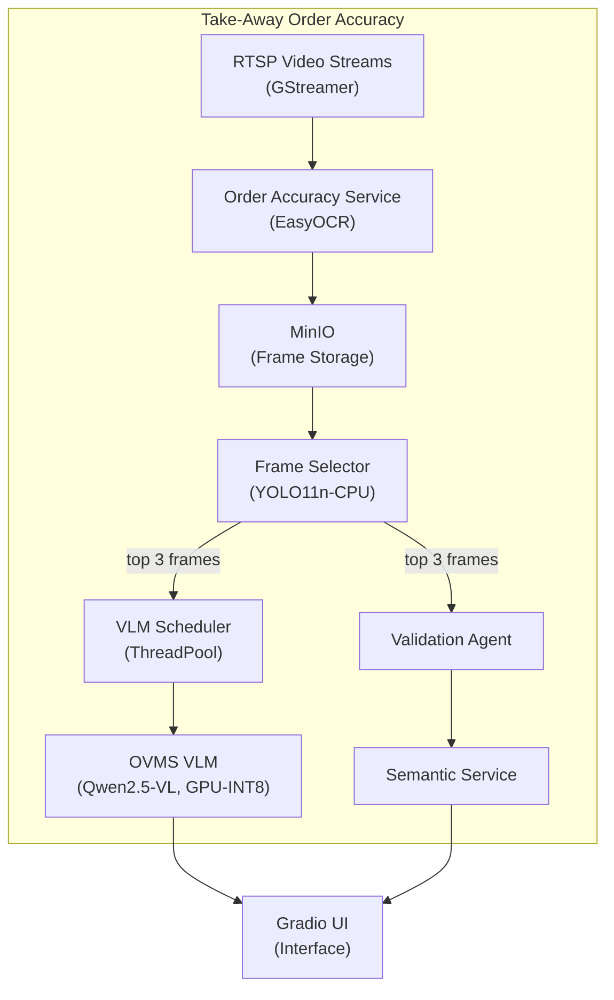
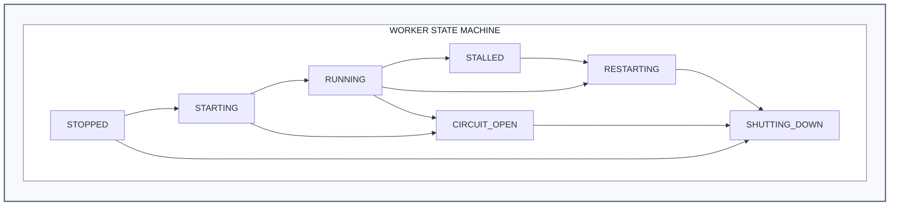
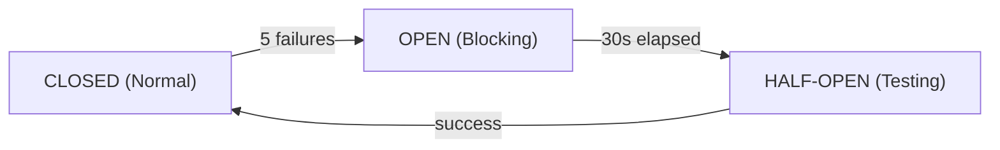

# How It Works

This document provides a comprehensive technical overview of the system architecture, component interactions, data flows, and design decisions.

## System Architecture

### High-Level Architecture



### Component Summary

| Component              | Technology                               | Purpose                         |
| ---------------------- | ---------------------------------------- | ------------------------------- |
| Order Accuracy Service | Python, FastAPI                          | Core orchestration and API      |
| Station Workers        | GStreamer (DL Streamer), multiprocessing | RTSP video processing           |
| VLM Scheduler          | Threading, queue batching                | Request optimization            |
| Frame Selector         | YOLO, OpenCV                             | Optimal frame detection         |
| OVMS VLM               | OpenVINO Model Server                    | Vision Language Model inference |
| Semantic Service       | FastAPI                                  | Text semantic matching          |
| Gradio UI              | Gradio                                   | Web interface                   |
| MinIO                  | S3-compatible storage                    | Frame and result storage        |

---

## Service Modes

The system supports two operational modes, each optimized for different deployment scenarios.

### Single Worker Mode

```text
┌──────────────────────────────────────────────────────────────┐
│                    SINGLE WORKER MODE                        │
│                                                              │
│  ┌────────────┐      ┌────────────────┐     ┌────────────┐   │
│  │  Gradio UI │────▶│  FastAPI REST  │────▶│  VLM       │   │
│  │            │      │  /upload-video │     │  Service   │   │
│  └────────────┘      └────────────────┘     └────────────┘   │
│                                                              │
│  Characteristics:                                            │
│  • Sequential video processing                               │
│  • Direct VLM calls (no batching)                            │
│  • Best for: Development, testing, demos                     │
└──────────────────────────────────────────────────────────────┘
```

**Configuration:**

```bash
SERVICE_MODE=single
WORKERS=0
```

**Features:**

- Video upload via REST API
- Single order at a time
- Gradio UI integration
- FastAPI Swagger documentation

### Parallel Worker Mode

```text
┌─────────────────────────────────────────────────────────────────────────────┐
│                         PARALLEL WORKER MODE                                │
│                                                                             │
│  ┌────────────┐   ┌────────────┐   ┌────────────┐                           │
│  │  Station   │   │  Station   │   │  Station   │  (independent,            │
│  │  Worker 1  │   │  Worker 2  │   │  Worker N  │   each with GStreamer     │
│  │ (GStr+OCR) │   │ (GStr+OCR) │   │ (GStr+OCR) │   + EasyOCR)              │
│  └─────┬──────┘   └─────┬──────┘   └─────┬──────┘                           │
│        │                │                │                                  │
│        ▼                ▼                ▼                                  │
│  ┌──────────────────────────────────────────────┐                           │
│  │              MinIO (Frame Storage)           │                           │
│  │         station_1/  station_2/  station_N/   │                           │
│  └─────────────────────┬────────────────────────┘                           │
│                        │                                                    │
│                        ▼                                                    │
│  ┌──────────────────────────────────────────────┐                           │
│  │       Frame Selector (YOLO11n - CPU)         │                           │
│  │       Select top 3 frames per order          │                           │
│  └─────────────────────┬────────────────────────┘                           │
│                        │                                                    │
│                        ▼                                                    │
│  ┌──────────────────────────────────────────────┐                           │
│  │     VLM Scheduler (ThreadPoolExecutor)       │                           │
│  │     Parallel requests to OVMS                │                           │
│  └─────────────────────┬────────────────────────┘                           │
│                        │                                                    │
│                        ▼                                                    │
│  ┌──────────────────────────────────────────────────────────────────────┐   │
│  │                           OVMS VLM (GPU)                             │   │
│  │              Qwen2.5-VL-7B / Continuous Batching                     │   │
│  └──────────────────────────────────────────────────────────────────────┘   │
│                                                                             │
│  Characteristics:                                                           │
│  • Independent RTSP stream per station                                      │
│  • Shared EasyOCR, YOLO, and VLM models                                     │
│  • Parallel VLM requests via ThreadPoolExecutor                             │
│  • OVMS continuous batching on GPU                                          │
│  • Best for: Production, multi-camera deployments                           │
└─────────────────────────────────────────────────────────────────────────────┘
```

**Configuration:**

```bash
SERVICE_MODE=parallel
WORKERS=N
SCALING_MODE=fixed  # or 'auto'
```

**Features:**

- Independent GStreamer pipeline per station
- Shared EasyOCR, YOLO, and VLM models across stations
- Parallel VLM requests via ThreadPoolExecutor
- OVMS continuous batching on GPU
- Circuit breaker pattern with exponential backoff

---

## Core Components

### 1. Main Entry Point (`src/main.py`)

The unified service entry point manages mode selection and service initialization.

```python
# Mode Selection Logic
SERVICE_MODE = os.getenv("SERVICE_MODE", "single")

if SERVICE_MODE == "single":
    # Start FastAPI with REST endpoints
    run_single_mode()
elif SERVICE_MODE == "parallel":
    # Start multi-worker orchestration
    run_parallel_mode()
```

**Responsibilities:**

- Environment configuration loading
- Mode-based service initialization
- Signal handling for graceful shutdown
- Worker process spawning (parallel mode)
- Hostname-based station detection

### 2. Station Worker (`src/parallel/station_worker.py`)

Production-ready worker process for single camera stream processing.

```text
┌─────────────────────────────────────────────────────────────┐
│                    STATION WORKER LIFECYCLE                   │
│                                                               │
│  ┌──────────┐   ┌──────────┐   ┌──────────┐   ┌──────────┐ │
│  │Initialize│──▶│Wait RTSP │──▶│  Start   │──▶│ Monitor  │ │
│  │          │   │          │   │ Pipeline │   │ Health   │ │
│  └──────────┘   └──────────┘   └──────────┘   └────┬─────┘ │
│                                                     │        │
│       ┌──────────────────┬──────────────────────────┘        │
│       │                  │                                    │
│       ▼                  ▼                                    │
│  ┌──────────┐      ┌──────────┐      ┌──────────┐           │
│  │ Circuit  │      │ Backoff  │      │  Verify  │           │
│  │ Breaker  │─────▶│ & Retry  │─────▶│  RTSP    │──▶Restart │
│  │  Check   │      │          │      │          │           │
│  └──────────┘      └──────────┘      └──────────┘           │
└─────────────────────────────────────────────────────────────┘
```

**Key Features:**

| Feature             | Implementation                                     |
| ------------------- | -------------------------------------------------- |
| GStreamer Pipeline  | RTSP → H.264 decode → `gvapython` frame processing |
| Circuit Breaker     | 5 failures in 120s (2 min) → 10s cooldown          |
| Exponential Backoff | 1s → 2s → 4s → ... → 15s max                       |
| Stall Detection     | No EOS markers for 120s triggers restart           |
| Health Monitoring   | Frame rate, pipeline state tracking                |

**Configuration (`src/parallel/station_worker.py`):**

```python
@dataclass
class PipelineConfig:
    rtsp_latency_ms: int = 0             # Zero buffering
    rtsp_retry_count: int = 50
    rtsp_timeout_us: int = 2000000       # 2 seconds
    restart_base_delay_sec: float = 1.0
    restart_max_delay_sec: float = 15.0
    circuit_breaker_max_failures: int = 5
    circuit_breaker_window_sec: float = 120.0   # 2 minutes
    circuit_breaker_cooldown_sec: float = 10.0
    stall_detection_timeout_sec: float = 120.0  # 2 minutes
```

### 3. VLM Scheduler (`src/parallel/vlm_scheduler.py`)

Request batching scheduler optimizing OVMS throughput.

```text
┌─────────────────────────────────────────────────────────────────────────┐
│                         VLM SCHEDULER ARCHITECTURE                       │
│                                                                          │
│  Worker 1 ──┐                                                            │
│             │     ┌─────────────┐     ┌───────────────┐                 │
│  Worker 2 ──┼────▶│  Collector  │────▶│               │                 │
│             │     │   Thread    │     │    Batch      │    ┌─────────┐  │
│  Worker N ──┘     │             │     │    Buffer     │───▶│  OVMS   │  │
│                   └─────────────┘     │   (50-100ms)  │    │   VLM   │  │
│                                       │               │    └────┬────┘  │
│                   ┌─────────────┐     └───────────────┘         │       │
│  Response ◀───────│  Response   │◀──────────────────────────────┘       │
│  Routing          │   Router    │                                        │
│                   └─────────────┘                                        │
│                                                                          │
│  Time-window batching: Collect requests for 50-100ms, send as batch     │
│  Fair scheduling: Round-robin across workers                             │
│  Backpressure: Queue limits prevent memory exhaustion                   │
└─────────────────────────────────────────────────────────────────────────┘
```

**Batching Strategy:**

- **Time Window**: 50-100ms collection period
- **Max Batch Size**: Configurable (default: 16)
- **Fair Scheduling**: Round-robin request servicing
- **Response Routing**: Match responses to original requesters

### 4. VLM Component (`src/core/vlm_service.py`)

Vision Language Model processing with inventory detection and order validation.

**Responsibilities:**

- Process selected frames through VLM
- Generate item detection prompts
- Parse VLM responses into structured data
- Coordinate with validation agent

### 5. OVMS VLM Client (`src/core/ovms_client.py`)

OpenVINO Model Server client with OpenAI-compatible API.

```text
┌─────────────────────────────────────────────────────────────┐
│                      OVMS CLIENT                             │
│                                                              │
│  ┌────────────┐     ┌────────────────┐     ┌────────────┐  │
│  │   Image    │────▶│  Base64        │────▶│   POST     │  │
│  │  (numpy)   │     │  Encoding      │     │/v3/chat/   │  │
│  └────────────┘     └────────────────┘     │completions │  │
│                                             └─────┬──────┘  │
│                                                   │         │
│  ┌────────────┐     ┌────────────────┐           │         │
│  │  Metrics   │◀────│   Response     │◀──────────┘         │
│  │  Logging   │     │   Parsing      │                      │
│  └────────────┘     └────────────────┘                      │
└─────────────────────────────────────────────────────────────┘
```

**API Integration:**

```python
# OpenAI-compatible chat/completions endpoint
response = requests.post(
    f"{OVMS_ENDPOINT}/v3/chat/completions",
    json={
        "model": OVMS_MODEL_NAME,
        "messages": [
            {
                "role": "user",
                "content": [
                    {"type": "text", "text": prompt},
                    {"type": "image_url", "image_url": {"url": f"data:image/jpeg;base64,{img_b64}"}}
                ]
            }
        ],
        "max_completion_tokens": 100
    }
)
```

---

## Data Flow Pipeline

### Complete Request Flow

1. **Video Capture**:
   RTSP Camera → GStreamer Pipeline → Frame Buffer

2. **Frame Selection**:
   - Frame Selector (YOLO):
     - Object detection on raw frames
     - Score frames by item visibility
     - Select top K frames per order
     - Store selected frames in MinIO

3. **VLM Processing**:
   - VLM Scheduler → OVMS (Qwen2.5-VL):
     - Batch frames by time window
     - Send to OVMS with detection prompt
     - Parse structured item response

4. **Order Validation**:
   - Validation Agent:
     - Compare detected items with expected order
     - Exact match → Semantic match → Flag mismatch
     - Generate validation result

5. **Result Output**:
   - { "matched": [...], "missing": [...], "extra": [...] }

### State Transitions



---

## Video Processing Architecture

### GStreamer Pipeline

The pipeline is built in `src/parallel/station_worker.py` using DL Streamer's `gvapython` plugin for per-frame processing:

```
rtspsrc location=<url> latency=0 buffer-mode=0 protocols=tcp ntp-sync=false do-rtcp=false retry=5
! rtph264depay
! avdec_h264
! videoconvert
! video/x-raw,format=BGR
! videorate ! video/x-raw,framerate=<CAPTURE_FPS>/1
! queue max-size-buffers=200 leaky=no
! gvapython module=frame_pipeline function=process_frame
! fakesink sync=false
```

`CAPTURE_FPS` defaults to `10`. The `gvapython` element calls `frame_pipeline.process_frame()` per frame, which handles EasyOCR order slip detection and MinIO frame upload.

---

## VLM Integration

### Model Architecture

```text
┌─────────────────────────────────────────────────────────────────────────────────┐
│                         OVMS VLM INTEGRATION                                     │
│                                                                                  │
│  Model: Qwen/Qwen2.5-VL-7B-Instruct                                             │
│                                                                                  │
│  ┌────────────────────────────────────────────────────────────────────────┐    │
│  │                         OVMS Model Server                               │    │
│  │                                                                         │    │
│  │  ┌────────────────┐    ┌────────────────┐    ┌────────────────┐       │    │
│  │  │  Vision        │    │  Language      │    │  Output        │       │    │
│  │  │  Encoder       │───▶│  Model         │───▶│  Decoder       │       │    │
│  │  │  (ViT-based)   │    │  (Qwen2.5)     │    │  (JSON)        │       │    │
│  │  └────────────────┘    └────────────────┘    └────────────────┘       │    │
│  │                                                                         │    │
│  │  API: OpenAI-compatible /v3/chat/completions                           │    │
│  │  Port: 8001 (configurable)                                             │    │
│  │  Precision: INT8 (optimized for inference)                             │    │
│  └────────────────────────────────────────────────────────────────────────┘    │
│                                                                                  │
└─────────────────────────────────────────────────────────────────────────────────┘
```

### Request/Response Format

**Request:**

```json
{
  "model": "Qwen/Qwen2.5-VL-7B-Instruct",
  "messages": [
    {
      "role": "user",
      "content": [
        { "type": "text", "text": "Identify all food items in this image..." },
        {
          "type": "image_url",
          "image_url": { "url": "data:image/jpeg;base64,..." }
        }
      ]
    }
  ],
  "max_completion_tokens": 100,
  "temperature": 0.2
}
```

**Response:**

```json
{
  "choices": [
    {
      "message": {
        "content": "{\"detected_items\": [{\"name\": \"burger\", \"quantity\": 2}]}"
      }
    }
  ],
  "usage": {
    "prompt_tokens": 1250,
    "completion_tokens": 45,
    "total_tokens": 1295
  }
}
```

---

## Frame Selection Service

### YOLO-Based Frame Selection

**Frame selector service (`frame_selector.py`):**

1. Monitor frames bucket in MinIO
2. Run YOLO object detection on each frame
3. Score frames by:
   - Object detection confidence
   - Item visibility/occlusion
   - Frame quality (blur, brightness)
4. Select TOP_K frames per order
5. Store selected frames in 'selected' bucket
6. Trigger VLM processing via HTTP callback

- Configuration:
  - TOP_K: 3 (frames per order)
  - POLL_INTERVAL: 1.5s
  - MIN_FRAMES_PER_ORDER: 1
  - YOLO_MODEL: yolo11n (INT8 OpenVINO)

The selection algorithm scores each frame using YOLO detection confidence and item count, then selects the top `TOP_K` frames per order. Implementation is in `frame-selector-service/`.

---

## Semantic Matching

### Matching Architecture

**Semantic matching system:**

- Validation agent
  - Pass 1: Exact match
    - "burger" == "burger" → MATCH
  - Pass 2: Semantic match (if exact fails)
    - "quarter pounder" ≈ "quarterpounder" → MATCH (semantic similarity)
  - Pass 3: Flag mismatch
    - No match found → Add to "missing" or "extra"

- Semantic service integration
  - External microservice: `http://semantic-service:8080`
  - Fallback: Local semantic matching if service unavailable

### Matching Strategies

| Strategy   | Description                | Use Case            |
| ---------- | -------------------------- | ------------------- |
| `exact`    | String equality comparison | Fast, deterministic |
| `semantic` | Embedding similarity       | Handles variations  |
| `hybrid`   | Exact first, then semantic | Recommended default |

---

## Docker Services Topology

### Service Deployment

```text
┌─────────────────────────────────────────────────────────────────────────────────┐
│                         DOCKER SERVICES TOPOLOGY                                │
│                                                                                 │
│  ┌─────────────────────────────────────────────────────────────────────────┐    │
│  │                         order-accuracy-net                              │    │
│  │                                                                         │    │
│  │  ┌──────────────┐  ┌──────────────┐  ┌──────────────┐                   │    │
│  │  │   minio      │  │  ovms-vlm    │  │order-accuracy│                   │    │
│  │  │   :9000/9001 │  │   :8001      │  │   :8000      │                   │    │
│  │  └──────────────┘  └──────────────┘  └──────────────┘                   │    │
│  │                                                                         │    │
│  │  ┌──────────────┐  ┌──────────────┐  ┌──────────────┐                   │    │
│  │  │frame-selector│  │  gradio-ui   │  │semantic-svc  │                   │    │
│  │  │  (internal)  │  │   :7860      │  │   :8080      │                   │    │
│  │  └──────────────┘  └──────────────┘  └──────────────┘                   │    │
│  │                                                                         │    │
│  │  ┌──────────────┐                                                       │    │
│  │  │rtsp-streamer │  (parallel profile)                                   │    │
│  │  │   :8554      │                                                       │    │
│  │  └──────────────┘                                                       │    │
│  │                                                                         │    │
│  └─────────────────────────────────────────────────────────────────────────┘    │
│                                                                                 │
│  Volumes:                                                                       │
│  • minio-data: S3-compatible object storage                                     │
│  • videos: Input video files                                                    │
│  • results: Output results and metrics                                          │
│  • models: OVMS model files                                                     │
│                                                                                 │
└─────────────────────────────────────────────────────────────────────────────────┘
```

### Service Dependencies

```yaml
services:
  order-accuracy:
    depends_on:
      - minio
      - ovms-vlm

  frame-selector:
    depends_on:
      - minio
      - order-accuracy

  gradio-ui:
    depends_on:
      - order-accuracy
```

---

## Production Patterns

### Circuit Breaker Pattern



**Configuration:**

- Failure threshold: 5 failures
- Time window: 120 seconds (2 minutes)
- Cooldown period: 10 seconds

### Exponential Backoff

Backoff sequence: 1s → 2s → 4s → 8s → 15s (max), with jitter. Implemented in `src/parallel/station_worker.py`.

### Health Monitoring

```python
@dataclass
class PipelineMetrics:
    pipeline_restarts: int = 0
    pipeline_failures: int = 0
    rtsp_unavailable_events: int = 0
    successful_frames_processed: int = 0
    circuit_breaker_trips: int = 0
    stall_detections: int = 0
    last_frame_time: float = 0.0
    pipeline_start_time: float = 0.0
    total_uptime_sec: float = 0.0
```

---

## Scalability Considerations

### Horizontal Scaling

Scaling architecture:

- Fixed Scaling (SCALING_MODE=fixed):
  - Static worker count defined at startup
  - Configuration: WORKERS=N (set at startup)

- Auto Scaling (SCALING_MODE=auto):
  - Dynamic worker adjustment based on metrics
  - Scale up triggers:
    - GPU utilization > 80%
    - Average VLM latency > target
    - Request queue depth > threshold
  - Scale down triggers:
    - GPU utilization < 30%
    - Idle workers for > 5 minutes

- Bottleneck Analysis:
  - VLM inference: Primary bottleneck (~2-3s per request)
  - Mitigation: Request batching via VLM Scheduler
  - Target throughput: 20-30 orders/minute per GPU

### Performance Optimization

| Optimization       | Implementation                                   |
| ------------------ | ------------------------------------------------ |
| VLM Batching       | 50-100ms time windows via VLM Scheduler          |
| Frame Selection    | YOLO pre-filtering reduces unnecessary VLM calls |
| INT8 Quantization  | OpenVINO INT8 model served via OVMS              |
| Connection Pooling | HTTP session reuse to OVMS                       |

---

## Summary

Take-Away Order Accuracy is a production-ready system designed for high-throughput, reliable order validation in QSR environments. Key architectural highlights:

1. **Dual-Mode Operation**: Single worker for development, parallel workers for production
2. **Resilient Video Processing**: GStreamer with circuit breaker and auto-recovery
3. **Optimized VLM Inference**: Request batching and INT8 quantization
4. **Intelligent Frame Selection**: YOLO-based filtering reduces unnecessary VLM calls
5. **Hybrid Matching**: Exact + semantic matching for robust item comparison
6. **Production Patterns**: Circuit breaker, exponential backoff, health monitoring

For deployment and configuration details, see the companion guides in this documentation suite.

---

## System Requirements

See the [System Requirements](./get-started/system-requirements.md) for detailed hardware, software, and network prerequisites.

---

## Pre-Deployment Checklist

- [ ] Docker and Docker Compose installed and working
- [ ] Intel GPU drivers installed and GPU visible to Docker
- [ ] Required ports available (8000, 7860, 8001, 9000, 9001, 8080)
- [ ] At least 50 GB free disk space
- [ ] VLM model downloaded (`setup_models.sh` completed)
- [ ] `.env` file configured
- [ ] Camera RTSP URLs accessible from host (parallel mode)
