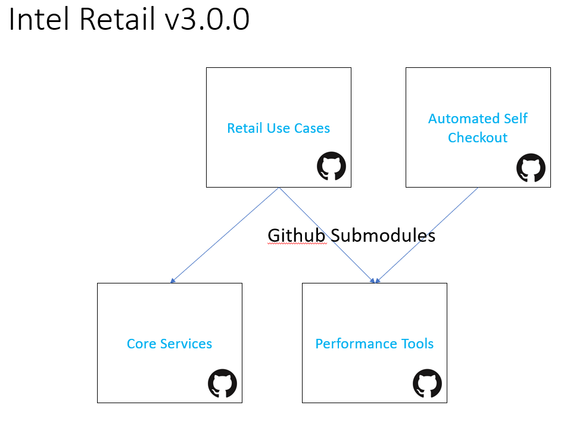
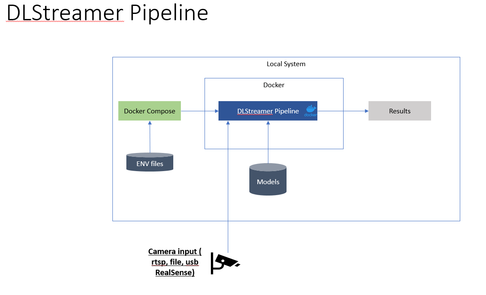
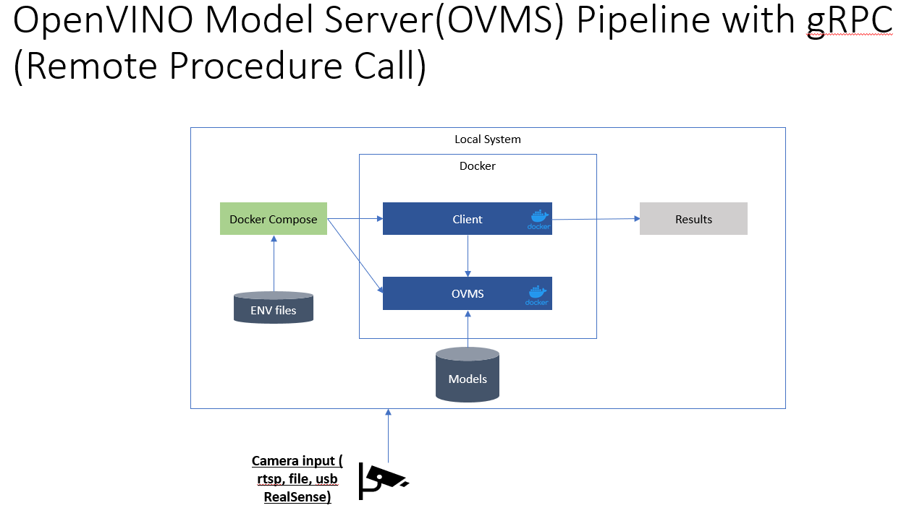
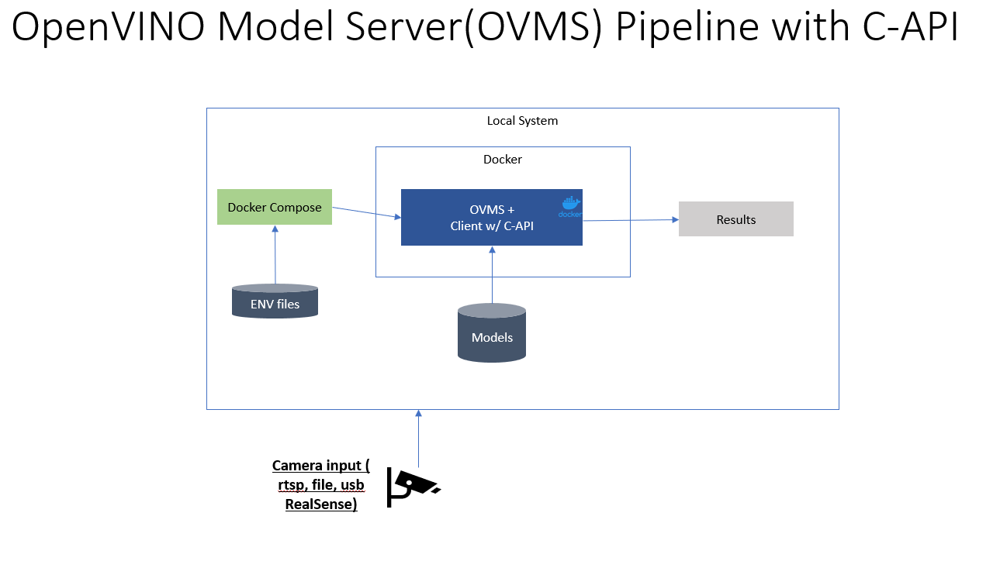

# Intel Retail

## Repositories

In release v3.0.0 Intel-retail modules have been organized into logical repositories. By taking advantage of github submodules different modules can be refrenced from other repositories. For example performance tools are being used by retail-use-cases and automated-self-checkout. Rather than duplicating and maintaining performance tools between the two repositories we linked the latest performance tools release as a submodule. 

## Frameworks

### OpenVINO

OpenVINO is an open source toolkit provided by Intel to assist with running AI and ML on Intel hardware. The tools include a portable inference engine that is compatible with different Intel hardware platforms. The code can be found on the [OpenVINO Github](https://github.com/openvinotoolkit/openvino) and examples can be ran through the [OpenVINO Jupyter Notebooks](https://github.com/openvinotoolkit/openvino_notebooks).

OpenVINO provides some pre-trained models for quick development and testing through the [OpenVINO Model Zoo](https://github.com/openvinotoolkit/open_model_zoo). OpenVINO also supports converting models through they [Model Conversion Process](https://docs.openvino.ai/2024/openvino-workflow/model-preparation/convert-model-to-ir.html)

Details about the latest version can be found in the [OpenVINO Release Notes](https://www.intel.com/content/www/us/en/developer/articles/release-notes/openvino/2024-1.html).

### DLStreamer Pipeline

Rather than working directly with the OpenVINO APIs our solutions offers more practical ways to interface with OpenVINO. One method is using [Intel DLStreamer](https://github.com/dlstreamer/dlstreamer). This solution provides a no code way based on [GStreamer](https://gstreamer.freedesktop.org/) and [OpenVINO](https://www.intel.com/content/www/us/en/developer/tools/openvino-toolkit/get-started.html) to deploy, process, and output a pipeline. 

The diagrams show how we take advantage of Docker, Docker Compose, and environment variable files to pre-package DLStreamer based pipelines for our use cases. Leveraging Environment Variables allows users to modify properties on the fly when different configurations are required.

### OpenVINO Model Server(OVMS)

Another solution is the [OpenVINO Model Server(OVMS)](https://github.com/openvinotoolkit/model_server). OVMS is a model hosting server that hosts inference models through a set of APIs. Unlike DLStreamer this solution requires developers to write code for pre and post processing model inference results. The advantage is the additional control developers have over their inference processing. Another benefit is the distribution of inference workloads between multiple servers either locally or remotely.

#### OpenVINO Model Server(OVMS) Pipeline with gRPC (Remote Procedure Call)

There are two methods for running your inference through OVMS. The more flexible method has the client use gRPC (Remote Procedure Call)  to request inference results from OVMS. By providing the proper input type and format the client can push inference comput to OVMS. OVMS can be local or on a remote system as long as the requested model is supported. This provides great flexibility with only minor latency increase. 

The gRPC interface supports c/c++, python, and golang. A python example is located in our [retial-use-cases gRPC python](https://github.com/intel-retail/retail-use-cases/tree/main/use-cases/grpc_python). The diagram show how the Docker Compose will deploy the client and OVMS. 

#### OpenVINO Model Server(OVMS) Pipeline with C API

When performance is more important than flexibility a developer can use the C API to bypass the gRPC interface and reudce latency. This method is currently only supported for c/c++ and required client/OVMS to both be deployed in a single Docker container. and example of a C API pipeline can be found in [retail-use-cases gst_capi](https://github.com/intel-retail/retail-use-cases/tree/main/use-cases/gst_capi). Similar to DLStreamer the Docker Compose only launches a single container per pipeline now that the client/OVMS directly connect through the C API.

## Performance

More details about benchmarking pipelines can be found on the [Performance Tools Page](../performance-tools/benchmark.md).
