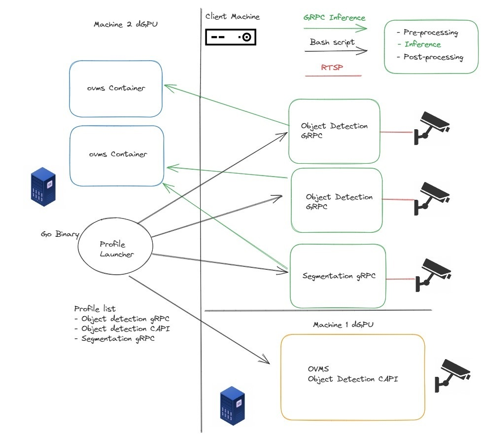
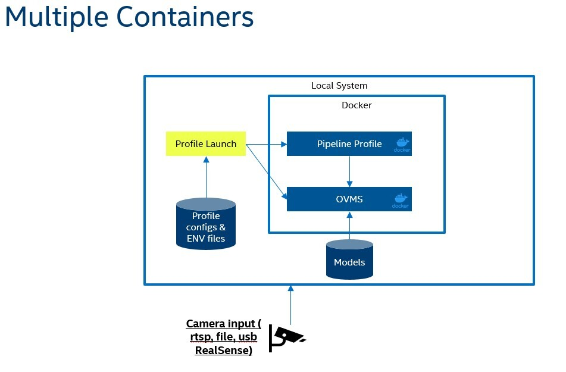

# Distributed Architecture

<!--ts-->

- [Status](#status)
- [Decision](#decision)
- [Context](#context)
- [Proposed Design](#proposed-design)
- [Consequences](#consequences)
- [References](#references)

<!--te-->

## Decision

<!-- Requirements approval board will update this section with justification for approval or rejection -->

## Context  

<!-- Please provide context to the requirement. -->

Depending on the underlying pipeline architecture you may only require one Docker container or you may require many Docker containers. Specifically OVMS has two methods for running: gRPC which uses remote inference calls from a client to server and Capi which does the inferencing locally. Additionally other methods such as GStreamer are run in a single container. The profiles should be able to accommodate both use cases.

## Proposed Design 

<!-- Please provide a high level design of the proposed requirement. -->

Update the profile to handle an array of configurations. This will allow the user to mix multiple Docker container configurations into a single profile.

Each container configuration will contain the following information:
- Docker image: The profile launcher will use as the target image
- Environment file: Loaded into the container
- Entrypoint script: Launch the desired start process
- Input arguments: container or entrypoint script
- Docker Volumes: Mounted to the container
- Docker Networks: Connected to the container

### Single Container Profile

A single container profile will run a single Docker image using a single entrypoint script. This use case will be for pipelines that are self contained in a single container. Although the container can interact with other containers on the system the performance tools will only measure the performance of the single running container.

### Multiple Container Profile

A multiple container profile will run the array of containers defined in the profile config. Each container can have it's own entrypoint script even if they utilize the same base Docker image. The common profile will be the OpenVINO Model Server and client. In this case a OVMS container will contain the inference models defined in the config.json from the profile. Once the OVMS container is started the client will be launched and connect to the OVMS container. This will result in the inference workload being executed in a difference service which can be on the local system or in a remote location. 

## Applicable Repos

[automated-self-checkout](https://github.com/intel-retail/automated-self-checkout)

## Consequences

<!-- Please provide a description of what consequences this requirement will have on the project. This includes breaking and non-breaking changes to all microservices -->

All profiles will need to be updated to use this new array structure. As a benefit common containers such as the OpenVINO Model Server can be shared between profiles.

## References

<!-- [link](requirements-review-process.md) - useful links for the design -->

https://docs.openvino.ai/2023.0/ovms_what_is_openvino_model_server.html
https://github.com/openvinotoolkit/model_server