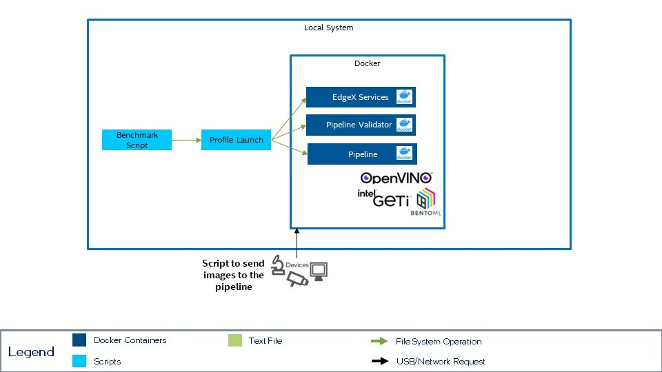

# Integration of AI Connect for Scientific Devices (AiCSD)

<!--ts-->

- [Decision](##decision)
- [Context](##context)
- [Proposed Design](##proposed-design)
- [References](##references)

<!--te-->

## Decision

<!-- Requirements approval board will update this section with justification for approval or rejection -->

## Context

<!-- Please provide context to the requirement. -->

This feature would:

- provide the ability to integrate pipelines using Intel Geti, BentoML or OpenVino
- provide the ability to run the entire AiCSD framework including sending images from another machine
- extend the capability of AiCSD to process still images to include video streams
- integrate EdgeX

## Proposed Design

<!-- Please provide a high level design of the proposed requirement. -->

### Crawl: Integration of the Pipeline

In the initial phases, the solution can be pulled in as just the pieces surrounding the pipeline validation. In order to do this, the [Pipeline Validator](https://intel.github.io/AiCSD/services/as-pipeline-val.html) service can be pulled in. This service 
provides the appropriate endpoints and components necessary to call any pipeline built for this system. In the simplest case, the Pipeline Validator service could be used with the 
Pipeline Simulator service without the need to add additional models. In order to call these services
or provide enough data to run benchmarking, it would be necessary to add a script
that calls the endpoint to launch the pipeline.

Necessary Components:

- Pipeline Validator Service
- EdgeX Services
- Pipeline from the options below:
      - Pipeline Simulator (standalone)
      - Intel Geti
      - OVMS
      - BentoML
- Script to call launch pipeline for each image in a directory 
(or a script that sends the same image for a fixed period of time)
- Integrate the ability to launch the appropriate target from the profile launcher

### Walk: Integrate the file dropping capability

Integrate the entire AiCSD solution to add the ability to use two machines - one for generating
image and the other for performing the processing. In integration of this feature,
it would also be possible to run AiCSD all on one system. The integration will allow 
for benchmarking to run alongside this solution.

Necessary components:

- Desired pipeline
- AiCSD Gateway Services
- Integration of launching services with the profile launcher

### Run: Add Video Streaming Capability

This feature would allow for the use of video streaming with models supported by 
Intel Geti or BentoML. In this solution, it could be necessary to update the AiCSD 
solution in order to support the use of video streams. 

## References

<!-- [link](requirements-review-process.md) - useful links for the design -->

- [AiCSD Architecture Overview](https://intel.github.io/AiCSD/services/general-info.html)
- [AiCSD Pipeline Creation](https://intel.github.io/AiCSD/pipelines/pipeline-creation.html)
