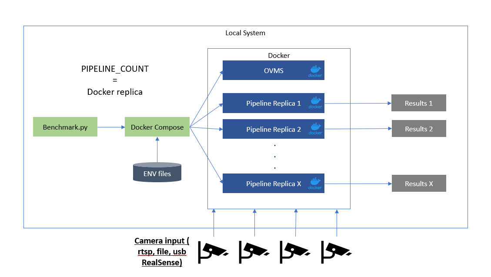
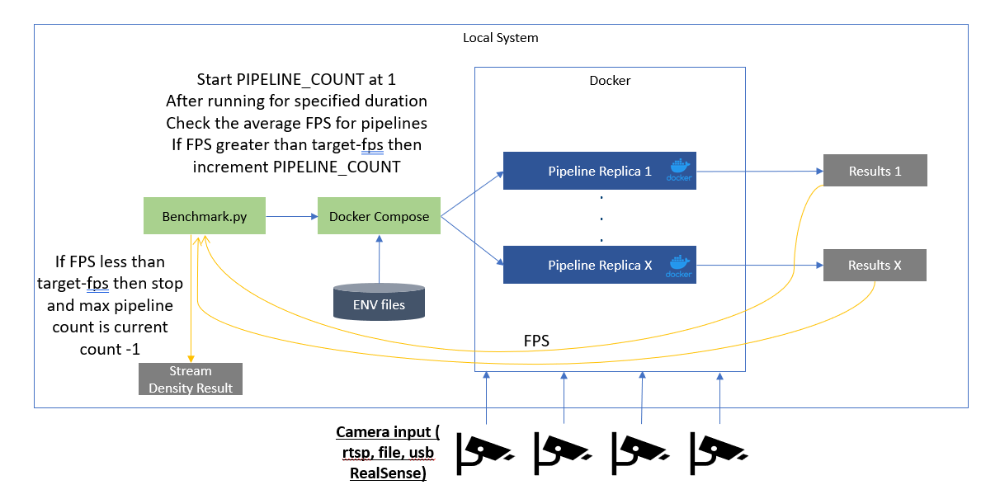
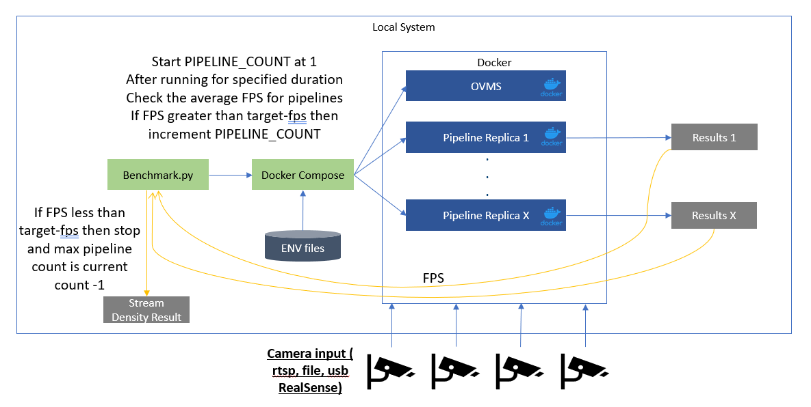

# Computer Vision Pipeline Benchmarking

The provided Python-based script works with Docker Compose to get pipeline performance
metrics like video processing in frames-per-second (FPS), memory usage, power
consumption, and so on.

# Prerequisites 

- Docker
- Docker Compose
- Make
- Git
- Code from [Retail Use Cases Repo](https://github.com/intel-retail/retail-use-cases) and its submodule [Performance Tools Repo](https://github.com/intel-retail/performance-tools)

    !!! Note
        To install the submodule, run `make update-submodules` from the root of the retail-use-cases repo.

- Python environment v3.12.2
  
    !!! Note
        This could be accomplished using [Miniconda](https://conda.io/projects/conda/en/latest/user-guide/tasks/manage-python.html) and creating a [Python 3.12.2 env](https://conda.io/projects/conda/en/latest/user-guide/tasks/manage-python.html)

    ```bash
        sudo apt install git gcc python3-venv python3-dev
    ```

# Benchmark a CV Pipeline

1. Build the benchmark container and change into the benchmark-scripts directory.

   ```bash
   cd performance-tools/
   make build-benchmark-docker   
   ```

2. Python packages listed in [performance-tools/benchmark-scripts/requirements.txt](https://github.com/intel-retail/performance-tools/blob/main/benchmark-scripts/requirements.txt)

    ```bash
        cd performance-tools/benchmark-scripts/
        python3 -m venv venv
        source venv/bin/activate
        pip install -r requirements.txt
    ```

3. Choose a CV pipeline from the Retail Use Cases Repo, Automated Self-Checkout or Loss Prevention and note the file paths to the docker compose files.

4. Run the benchmarking script using the docker compose file(s) as inputs to the script (sample command shown below).

    **Automated Self-Checkout:**
    ```bash
        python benchmark.py --compose_file ../../src/docker-compose.yml --pipeline 1
    ```

    **Retail Use Cases:**
    ```bash
        python benchmark.py --compose_file ../../use-cases/gst_capi/add_camera-simulator.yml --compose_file ../../use-cases/gst_capi/add_gst_capi_yolov5_ensemble.yml
    ```

[Go to Arguments to understand how to customize the benchmarks](#arguments)

Specific number of pipelines with single container

[](../images/performance-pipeline.png)

Specific number of pipelines with OVMS and Client

[](../images/performance-pipeline-ovms.png)

## Benchmark Stream Density for CV Pipelines

Benchmarking a pipeline can also discover the maximum number of workloads or streams that can be run in parallel for a given target FPS. This information is useful to determine the hardware required to achieve the desired performance for CV pipelines.

To run the stream density functionality use `--target_fps` and/or `--density_increment` as inputs to the `benchmark.py` script:

   ```bash
    python benchmark.py  --retail_use_case_root ../../retail-use-cases --target_fps 14.95 --density_increment 1 --init_duration 40   --compose_file ../../retail-use-cases/use-cases/grpc_python/docker-compose_grpc_python.yml
   ```

where the parameters:
- `target_fps` is the given target frames per second (fps) to achieve for maximum number of pipelines
- `density_increment` is to configure the benchmark logic to increase the number of pipelines each time while trying to find out the maximum number of pipelines before reaching the given target fps.
- `init_duration` is the initial duration period in second before pipeline performance metrics are taken


    !!! Note
        It is recommended to set --target_fps to a value lesser than your target FPS to account for real world variances in hardware readings.

Stream density with single container
[](../images/performance-stream-density.png)

Stream density with OVMS and Client
[](../images/performance-stream-density-ovms.png)

## Consolidate results

The **consolidate_multiple_run_of_metrics.py** script processes and consolidates performance metrics from various log files (JSON, CSV, and text-based logs) into a structured report. It extracts key performance indicators (KPIs) such as CPU & GPU utilization, memory bandwidth, disk I/O, power consumption, and FPS from multiple sources, aggregates the data, and outputs a summary file.

on peformance-tools/benchmark-scripts:

```bash
    make consolidate
```

The summary.csv content should look like this:

```
    Camera_20250303214521714278352 FPS,14.86265306122449
    Camera_20250303214521714278352 Last log update,03/03/2025 14:46:263943
    CPU Utilization %,10.069166666666668
    Memory Utilization %,19.70717535119376
    Disk Read MB/s,0.0
    Disk Write MB/s,0.002814426229508197
    S0 Memory Bandwidth Usage MB/s,8012.58064516129
    S0 Power Draw W,19.159666666666666
```

# Modifying Additional Benchmarking Variables

## Arguments

| Argument               | Type   | Default Value                                  | Description |
|------------------------|--------|----------------------------------------------|-------------|
| `--pipelines`         | `int`  | `1`                                          | Number of pipelines |
| `--target_fps`        | `float` (list) | `None`                        | Stream density target FPS; can take multiple values for multiple pipelines with 1-to-1 mapping via `--container_names` |
| `--container_names`   | `str` (list) | `None`                        | Container names for stream density target; used together with `--target_fps` for 1-to-1 mapping |
| `--density_increment` | `int`  | `None`                                       | Pipeline increment number for stream density; dynamically adjusted if not specified |
| `--results_dir`       | `str`  | `'./results'`                                | Full path to the directory for logs and results |
| `--duration`         | `int`  | `30`                                         | Time in seconds, not needed when `--target_fps` is specified |
| `--init_duration`     | `int`  | `20`                                         | Initial time in seconds before starting metric data collection |
| `--target_device`     | `str`  | `'CPU'`                                      | Desired running platform [cpu, core, xeon, dgpu.x] |
| `--compose_file`      | `str` (list) | `None`                         | Path(s) to Docker Compose files; can be used multiple times |
| `--retail_use_case_root` | `str` | `'../../'`                              | Full path to the retail-use-cases repo root |
| `--docker_log`        | `str`  | `None`                                       | Docker container name to get logs from and save to a file |
| `--parser_script`     | `str`  | `'./parse_csv_to_json.py'`                    | Full path to the parsing script to obtain FPS |
| `--parser_args`       | `str`  | `"-k device -k igt"`                         | Arguments to pass to the parser script; pass args with spaces in quotes: `"args with spaces"` |

## Change Power Profile

- For Ubuntu, follow this [documentation](https://help.ubuntu.com/stable/ubuntu-help/power-profile.html.en) to change the power profile.
- For Windows, follow this [documentation](https://support.microsoft.com/en-us/windows/change-the-power-mode-for-your-windows-pc-c2aff038-22c9-f46d-5ca0-78696fdf2de8) to change the power mode.

## Change or Customize Metric Parsing

Two arguments `--parser_script` and `--parser_args` control the script and arguments passed to it respectively from the benchmark script.

- The `--parser_script` can be a python script that takes at least an input argument of `-d <results_dir>`. This will automatically get passed to the parsing script from the benchmarking script. 
- Any other arguments may be passed using the `--parser_args`, where arguments with spaces are specified in double quotes.

# Developer Resources

## Python Testing

To run the unit tests for the performance tools:

```bash
cd benchmark-scripts
make python-test
```

To run the unit tests and determine the coverage:

```bash
cd benchmark-scripts
make python-coverage
```