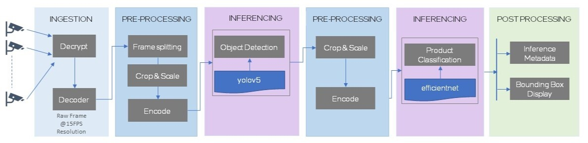

# Intel® Automated Self-Checkout Reference Package

> **🔄 Package Integration Notice**  
> The Automated Self-Checkout functionality has been consolidated into the [Intel® Loss Prevention Reference Package](../loss-prevention/loss-prevention.html) for a unified retail computer vision platform.

## What This Means for You

- **Existing Users**: Your automated self-checkout use cases are now supported in the Loss Prevention package
- **New Users**: Start directly with the Loss Prevention package for the latest features
- **Migration**: No code changes needed - simply use the new package location

## Why Computer Vision for Retail?

Automated self-checkout systems process complex visual data through multiple stages to transform raw video into actionable business insights:

1. **Video Ingestion**: Capture customer interactions and product movements in real-time
2. **Object Detection**: Identify products and items using YOLOv5 models
3. **Classification**: Categorize and verify items with EfficientNet algorithms  
4. **Analytics**: Generate loss prevention data and checkout validation

The pipeline below demonstrates this workflow, where video data flows through preprocessing, dual AI model inference (YOLOv5 and EfficientNet), and post-processing to generate metadata and visual bounding boxes for each frame.

This unified platform simplifies deployment complexity with pre-configured, hardware-optimized workflows that scale from pilot programs to enterprise-wide implementations.

## Integration Benefits

The automated self-checkout functionality has been consolidated into the Intel® Loss Prevention Reference Package, providing a unified platform for retail computer vision solutions. This integration offers several advantages:
> 
> - **Unified Platform**: Single application supporting both loss prevention and automated self-checkout use cases
> - **Hardware Optimization**: Pre-configured workloads optimized for Intel® CPU, GPU, and NPU hardware
> - **Flexible Deployment**: Multiple workload configurations including:
>   - Object Detection (CPU/GPU/NPU)
>   - Object Detection & Classification (CPU/GPU/NPU)
>   - Age Prediction & Face Detection (CPU/GPU/NPU)
>   - Heterogeneous configurations
> - **Simplified Management**: Single codebase, unified configuration, and streamlined deployment process
## What You Want to Do

### 🚀 I'm New to Intel Retail Solutions
**Quick Start (15 minutes)**: [Loss Prevention Getting Started Guide](https://intel-retail.github.io/documentation/use-cases/loss-prevention/getting_started.html)
- Set up your environment
- Run your first automated self-checkout demo  
- Understand the basic workflow

### ⚙️ I Want to Customize the Solution
**Advanced Configuration (30-60 minutes)**: [Loss Prevention Advanced Guide](https://intel-retail.github.io/documentation/use-cases/loss-prevention/advanced.html)
- Customize workload configurations
- Optimize for your hardware setup
- Configure multiple detection models

### 📊 I Need Performance Data
**Benchmark & Optimize**: [Loss Prevention Performance Guide](https://intel-retail.github.io/documentation/use-cases/loss-prevention/performance.html)
- Compare CPU/GPU/NPU performance
- Optimize for your specific use case
- Understand throughput metrics