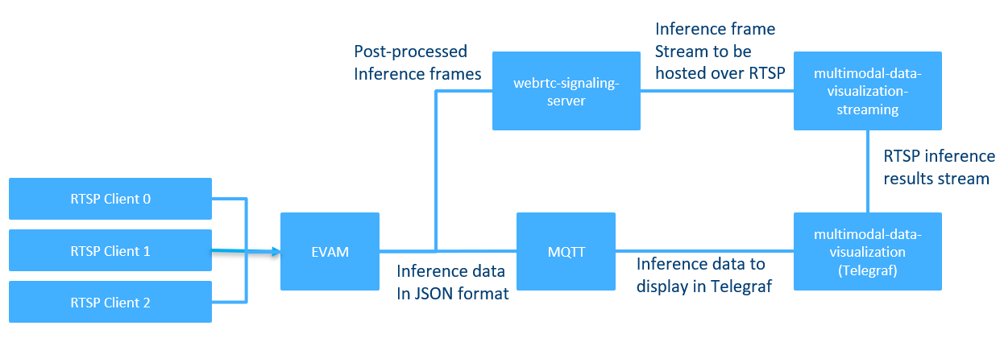
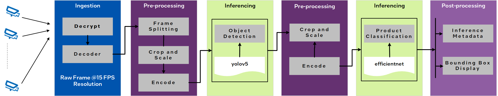

# Automated Self-Checkout Retail Reference Implementation

Use pre-configured optimized computer vision pipelines to build and deploy a self-checkout use case using Intel® hardware, software, and other open source software.

## Overview

The Automated Self-Checkout Reference Implementation provides essential components to build and deploy a self-checkout solution using Intel® hardware, software, and open source software. It includes the basic services to get you started running optimized Intel® Deep Learning Streamer (Intel® DLStreamer)-based computer vision pipelines. These services are modular, allowing for customization or replacement with your solutions to address specific needs.

### Features and Benefits

With this reference implementation, the self-checkout stations can:

* Recognize the non-barcoded items more quickly.
* Recognize the product SKU and items placed in transparent bags without requiring manual input.
* Reduce the steps in identifying products when there is no match by suggesting the top five closest choices. 

The pre-configured, optimized computer vision pipelines also accelerate the time to market. Inference results are published to Message Queuing Telemetry Transport (MQTT), allowing easy integration with other applications. The implementation includes examples of using different devices such as CPUs, integrated GPUs, and discrete GPUs.

## How It Works

In this reference implementation, the video streams from various cameras are cropped and resized to enable the inference engine to run the associated models. The object detection and product classification features identify the SKUs during checkout. The barcode detection, text detection, and recognition features further verify and increase the accuracy of the detected SKUs. The inference details are then aggregated and pushed to  MQTT to process the combined results further.

As Figure 1 shows, Docker Compose is used to deploy the reference implementation on different system setups easily. At the same time, MQTT Broker publishes the inference data that external applications or systems can use. Unique MQTT topics are created for each pipeline for a more refined approach to organizing inference outputs.

Figure 1: Automated Self-Checkout Architectural Diagram

Each automated self-checkout pipeline has a pre-configured setup optimized for running on Intel hardware. The following are the available pipelines: 

*   ``yolov5``: yolov5 object detection only.
*   ``yolov5_effnet``: yolov5 object detection and ``efficientnet_b0`` classification.
*   ``yolov5_full``: yolov5 object detection, ``efficientnet_b0`` classification, text detection, text recognition, and barcode detection.

Figure 2 shows a pipeline in which the video data is ingested and pre-processed before each inferencing step. The data is then analyzed using two models, ``YOLOv5`` and ``EfficientNet``, and post-processed to generate metadata and display bounding boxes for each frame. This pipeline is an example of the models and processing workflows supported in this reference implementation.

Figure 2: Example of a Pipeline Flow

The number of streams and pipelines that can be used are system-dependent. For more details, see the latest [performance data](https://www.intel.com/content/www/us/en/developer/topic-technology/edge-5g/tools/automated-self-checkout-benchmark-results.html). 

The following are the components in the reference implementation.

* <a href="https://edgeservicescatalog.intel.com/details/?microserviceType=recipe&microserviceNameForUrl=edge-video-analytics-microservice">**Edge Video Analytics Microservice (EVAM)**</a> is a Python-based, interoperable containerized microservice for the easy development and deployment of video analytics pipelines. It is built on [GStreamer](https://gstreamer.freedesktop.org/documentation/) and [Intel® DL Streamer](https://dlstreamer.github.io/), which provide video ingestion and deep learning inferencing functionalities, respectively.
* <a href="https://edgeservicescatalog.intel.com/details/?microserviceType=container&microserviceNameForUrl=multimodal-data-visualization">**Multimodal Data Visualization Microservice**</a> enables the visualization of video streams and time-series data.

## Learn More

- Get started with the Automated Self-Checkout Retail Reference Implementation using the [Get Started Guide](Get-Started-Guide.rst).
- Know more about [GStreamer](https://gstreamer.freedesktop.org/documentation/) and [Intel® Deep Learning Streamer (DL Streamer)](https://dlstreamer.github.io/).

