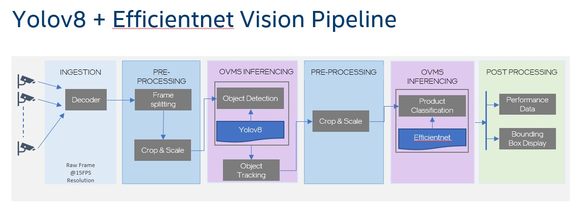

# Intel® C-API YOLOV8 Ensemble Object Detection Reference Package

## Overview

YOLOv8 is one of the popular YOLO object detection models. To show case the object detection of using YOLOv8, the efficientnet classification model will also be used to help validate the performance and accuracy of the C-API architecture.

The YOLOv8 + efficientnet design will follow a similar custom pipeline as the previously implemented YOLOv5 + efficientnet profile. The same gstreamer decoding will be used for the input stream. C-API will send the frames to the OpenVINO Model Server(OVMS) processing through the custom pipeline defined in the config.json. OVMS will output the object bounding boxes along with the object classification. The profile will also output the processing latency in Frames Per Second (FPS).

## Applicable Repos

[retail-use-cases-gst-capi-yolov8](https://github.com/intel-retail/retail-use-cases/tree/main/use-cases/gst_capi)

## Next Steps

To begin using the C-API YOLOv8 ensemble Helm/Kubernetes solution you can follow the [Getting Started Guide](./getting_started.md). 
