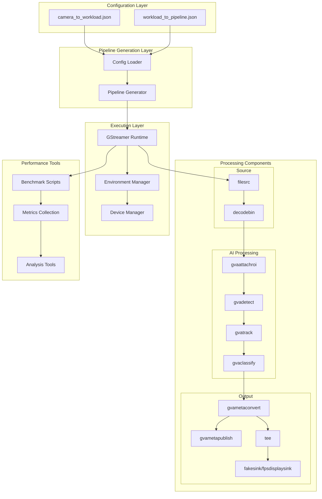
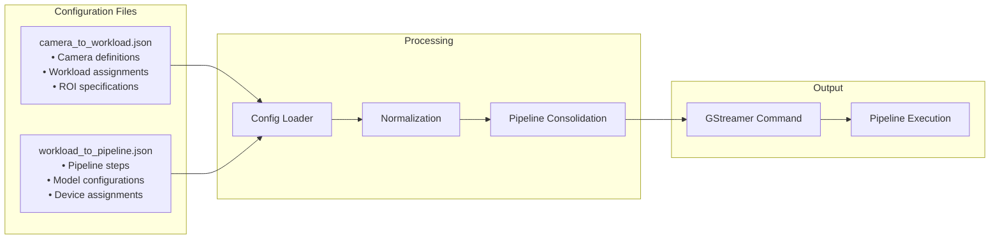

# Loss Prevention Pipeline System Architecture

## Table of Contents
1. [System Overview](#system-overview)
2. [Architecture Diagrams](#architecture-diagrams)
3. [Configuration Management](#configuration-management)
4. [System Benefits](#system-benefits)

## System Overview

The Loss Prevention Pipeline System is a comprehensive video analytics platform designed for retail loss prevention using Intel hardware acceleration. The system processes multiple camera feeds simultaneously, applying AI-powered detection and classification models to identify potential security incidents.

### Key Features
- **Multi-camera Support**: Simultaneous processing of multiple camera feeds
- **AI-Powered Analytics**: Object detection and classification using YOLO and EfficientNet models
- **Intel Hardware Optimization**: Leverages CPU, GPU, and NPU acceleration
- **Real-time Processing**: GStreamer-based pipeline for low-latency video processing
- **Flexible Configuration**: JSON-based configuration for cameras, workloads, and pipelines
- **Performance Monitoring**: Comprehensive metrics collection and analysis
- **Containerized Deployment**: Docker-based deployment with Intel DL Streamer

## Architecture Diagrams


### Component Architecture


### Configuration Flow


## Component Architecture

### Core Components

#### 1. Pipeline Generator (`gst-pipeline-generator.py`)
**Purpose**: Dynamic GStreamer pipeline generation based on configuration
**Key Functions**:
- Configuration loading and validation
- Pipeline signature generation for optimization
- Dynamic element creation based on workload requirements
- Device-specific environment variable management

#### 2. Configuration Management
**Files**:
- `camera_to_workload.json`: Camera definitions and workload assignments
- `workload_to_pipeline.json`: Pipeline step definitions

#### 3. GStreamer Elements
**Source Elements**:
- `filesrc`: Video file input
- `decodebin`: Automatic video decoding

**AI Processing Elements**:
- `gvaattachroi`: Region of Interest attachment
- `gvadetect`: Object detection using YOLO models
- `gvatrack`: Object tracking across frames
- `gvaclassify`: Object classification using EfficientNet

**Output Elements**:
- `gvametaconvert`: Metadata format conversion
- `gvametapublish`: Results publishing to files
- `tee`: Pipeline branching for multiple outputs


#### Environment Configuration
Device-specific environment files:
- `/res/all-cpu.env`: CPU optimization settings
- `/res/all-gpu.env`: GPU acceleration settings
- `/res/all-npu.env`: NPU configuration


## Configuration Management

### Camera Configuration
```json
{
  "lane_config": {
    "cameras": [
      {
        "camera_id": "cam1",
        "fileSrc": "video-file.mp4",
        "width": 1920,
        "fps": 15,
        "workloads": ["detection", "classification"],
        "region_of_interest": {
          "x": 0.1,
          "y": 0.1,
          "x2": 0.9,
          "y2": 0.9
        }
      }
    ]
  }
}
```

### Workload Configuration
```json
{
  "workload_pipeline_map": {
    "detection": [
      {
        "type": "gvadetect",
        "model": "yolov5s",
        "device": "GPU",
        "precision": "FP16"
      }
    ],
    "classification": [
      {
        "type": "gvaclassify",
        "model": "efficientnet-b0",
        "device": "NPU",
        "precision": "INT8"
      }
    ]
  }
}
```


## System Benefits

### Performance Advantages
- **Hardware Optimization**: Native Intel hardware acceleration
- **Pipeline Efficiency**: Optimized GStreamer pipelines with minimal overhead
- **Parallel Processing**: Multi-camera, multi-workload concurrent execution
- **Resource Management**: Intelligent device allocation and load balancing

### Scalability Features
- **Configuration-Driven**: Easy addition of new cameras and workloads
- **Modular Design**: Independent processing pipelines
- **Container-Based**: Horizontal scaling with Docker orchestration
- **Performance Monitoring**: Real-time metrics for optimization

---

*This architecture documentation provides a comprehensive overview of the Loss Prevention Pipeline System. For implementation details, refer to the source code and configuration files in the repository.*

