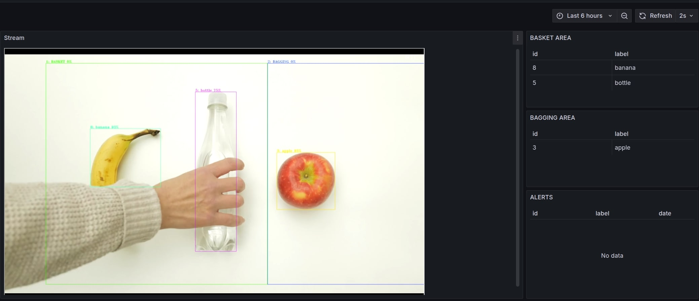

# Getting Started

## Step by step instructions:

1. Download the models using download_models/downloadModels.sh

    ```bash
    make download-models
    ```

2. Update github submodules

    ```bash
    make update-submodules
    ```

3. Download sample videos used by the performance tools

    ```bash
    make download-sample-videos
    ```

4. Build the demo Docker image

    ```bash
    make build
    ```

5. Start Loss prevention using the Docker Compose file. The Docker Compose also includes an RTSP camera simulator that will infinitely loop through the sample videos downloaded in step 3.

    ```bash
    RTSP=1 make run-render-mode
    ```

6. Open Grafana:

🔗 [Grafana Dashboard](http://127.0.0.1:3000/d/ce428u65d0irkf/loss-prevention?from=now-6h&to=now&timezone=browser&refresh=2s)




7. Verify Docker containers

    ```bash
    docker ps --format 'table{{.Names}}\t{{.Status}}\t{{.Image}}'
    ```
    Result:
    ```bash
    NAMES                 STATUS          IMAGE
    camera-simulator0    Up 17 seconds   jrottenberg/ffmpeg:4.1-alpine
    src-OvmsClientGst-1  Up 17 seconds   dlstreamer:dev
    camera-simulator     Up 17 seconds   aler9/rtsp-simple-server
    ```

8. Verify Results

    After starting Automated Self Checkout you will begin to see result files being written into the results/ directory. Here are example outputs from the 3 log files.

    gst-launch_<time>_gst.log
    ```
    /GstPipeline:pipeline0/GstGvaWatermark:gvawatermark0/GstCapsFilter:capsfilter1: caps = video/x-raw(memory:VASurface), format=(string)RGBA
    /GstPipeline:pipeline0/GstFPSDisplaySink:fpsdisplaysink0/GstXImageSink:ximagesink0: sync = true
    Got context from element 'vaapipostproc1': gst.vaapi.Display=context, gst.vaapi.Display=(GstVaapiDisplay)"\(GstVaapiDisplayGLX\)\ vaapidisplayglx0", gst.vaapi.Display.GObject=(GstObject)"\(GstVaapiDisplayGLX\)\ vaapidisplayglx0";
    Progress: (open) Opening Stream
    Pipeline is PREROLLED ...
    Prerolled, waiting for progress to finish...
    Progress: (connect) Connecting to rtsp://localhost:8554/camera_0
    Progress: (open) Retrieving server options
    Progress: (open) Retrieving media info
    Progress: (request) SETUP stream 0
    ```

    pipeline<time>_gst.log
    ```
    14.58
    14.58
    15.47
    15.47
    15.10
    15.10
    14.60
    14.60
    14.88
    14.88
    ```

    r<time>_gst.jsonl
```json

{
    "objects": [
        {
            "detection": {
                "bounding_box": {
                    "x_max": 0.7873924346958825,
                    "x_min": 0.6701603093745723,
                    "y_max": 0.7915918938548927,
                    "y_min": 0.14599881349270305
                },
                "confidence": 0.8677337765693665,
                "label": "bottle",
                "label_id": 39
            },
            "h": 697,
            "region_id": 610,
            "roi_type": "bottle",
            "w": 225,
            "x": 1287,
            "y": 158
        },
        {
            "detection": {
                "bounding_box": {
                    "x_max": 0.3221945836811382,
                    "x_min": 0.19950163649114616,
                    "y_max": 0.7924592239981934,
                    "y_min": 0.1336837231479251
                },
                "confidence": 0.8625879287719727,
                "label": "bottle",
                "label_id": 39
            },
            "h": 711,
            "region_id": 611,
            "roi_type": "bottle",
            "w": 236,
            "x": 383,
            "y": 144
        },
        {
            "detection": {
                "bounding_box": {
                    "x_max": 0.5730873789069046,
                    "x_min": 0.42000878963365595,
                    "y_max": 0.9749763191740435,
                    "y_min": 0.12431765065780453
                },
                "confidence": 0.854443371295929,
                "label": "bottle",
                "label_id": 39
            },
            "h": 919,
            "region_id": 612,
            "roi_type": "bottle",
            "w": 294,
            "x": 806,
            "y": 134
        }
    ],
    "resolution": {
        "height": 1080,
        "width": 1920
    },
    "timestamp": 755106652
}

```

9. Stop the demo using docker compose down
```bash
make down
```

## [Proceed to Advanced Settings](advanced.md)    
