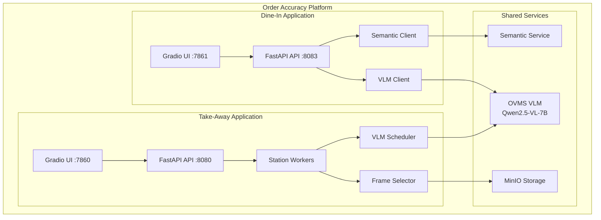

# Order Accuracy System Architecture

## Table of Contents
1. [System Overview](#system-overview)
2. [Architecture Diagrams](#architecture-diagrams)
3. [Component Details](#component-details)
4. [Data Flow](#data-flow)
5. [Production Features](#production-features)

## System Overview

The Order Accuracy platform is an enterprise AI vision system designed for real-time order validation in quick-service restaurant (QSR) environments. The system uses Vision Language Models (VLM) to analyze images or video feeds, automatically identifying items and validating them against order data.

### Key Features
- **VLM-Powered Detection**: Uses Qwen2.5-VL-7B for accurate item identification
- **Intel Hardware Optimization**: Optimized for Intel CPUs and GPUs via OpenVINO
- **Dual Application Support**: Dine-In (image-based) and Take-Away (video stream-based)
- **Semantic Matching**: Fuzzy matching for item name variations
- **Real-time Processing**: Sub-15-second validation for operational efficiency
- **Containerized Deployment**: Docker-based deployment with microservices architecture

## Architecture Diagrams

### Platform Architecture



### Dine-In Architecture

```
┌─────────────────────────────────────────────────────────────────────────────┐
│                           DINE-IN ORDER ACCURACY                            │
├─────────────────────────────────────────────────────────────────────────────┤
│                                                                             │
│  ┌─────────────┐      ┌──────────────────┐      ┌─────────────────────┐    │
│  │             │      │                  │      │                     │    │
│  │  Gradio UI  │─────▶│   FastAPI API    │─────▶│   Validation        │    │
│  │  (Port 7861)│      │   (Port 8083)    │      │   Service           │    │
│  │             │      │                  │      │                     │    │
│  └─────────────┘      └────────┬─────────┘      └──────────┬──────────┘    │
│                                │                           │               │
│                    ┌───────────┴───────────┐               │               │
│                    │                       │               │               │
│                    ▼                       ▼               ▼               │
│           ┌────────────────┐     ┌─────────────────┐ ┌───────────────┐    │
│           │  VLM Client    │     │ Semantic Client │ │ Metrics       │    │
│           │  (Circuit      │     │ (Circuit        │ │ Collector     │    │
│           │   Breaker)     │     │  Breaker)       │ │               │    │
│           └───────┬────────┘     └────────┬────────┘ └───────────────┘    │
│                   │                       │                               │
└───────────────────┼───────────────────────┼───────────────────────────────┘
                    │                       │
                    ▼                       ▼
          ┌─────────────────┐     ┌─────────────────┐
          │   OVMS VLM      │     │   Semantic      │
          │   (Qwen2.5-VL)  │     │   Service       │
          └─────────────────┘     └─────────────────┘
```

### Take-Away Architecture

```
┌──────────────────────────────────────────────────────────────────────────────────────┐
│                            TAKE-AWAY ORDER ACCURACY SYSTEM                           │
│                                                                                      │
│  ┌─────────────────┐    ┌─────────────────┐    ┌─────────────────┐                  │
│  │    RTSP Video   │    │  Frame Selector │    │      Order      │                  │
│  │     Streams     │───▶│     Service     │───▶│    Accuracy     │                  │
│  │   (GStreamer)   │    │     (YOLO)      │    │    Service      │                  │
│  └─────────────────┘    └─────────────────┘    └────────┬────────┘                  │
│                                                          │                           │
│         ┌────────────────────────────────────────────────┤                           │
│         │                                                │                           │
│         ▼                                                ▼                           │
│  ┌─────────────────┐                          ┌─────────────────┐                   │
│  │   VLM Scheduler │                          │    Validation   │                   │
│  │   (Batcher)     │                          │      Agent      │                   │
│  └────────┬────────┘                          └────────┬────────┘                   │
│           │                                            │                             │
│           ▼                                            ▼                             │
│  ┌─────────────────┐                          ┌─────────────────┐                   │
│  │    OVMS VLM     │                          │    Semantic     │                   │
│  │  (Qwen2.5-VL)   │                          │    Service      │                   │
│  └─────────────────┘                          └─────────────────┘                   │
│                                                                                      │
└──────────────────────────────────────────────────────────────────────────────────────┘
```

## Component Details

### Core Components

#### 1. VLM Backend (OVMS)

OpenVINO Model Server hosting Qwen2.5-VL-7B for vision-language inference.

**Features:**
- OpenAI-compatible API (`/v3/chat/completions`)
- INT8 quantization for optimized performance
- GPU acceleration via Intel/NVIDIA hardware
- Shared model instance for both applications

**API Usage:**
```python
response = requests.post(
    f"{OVMS_ENDPOINT}/v3/chat/completions",
    json={
        "model": "Qwen/Qwen2.5-VL-7B-Instruct",
        "messages": [
            {
                "role": "user",
                "content": [
                    {"type": "text", "text": prompt},
                    {"type": "image_url", "image_url": {"url": f"data:image/jpeg;base64,{img_b64}"}}
                ]
            }
        ]
    }
)
```

#### 2. Semantic Comparison Service

AI-powered semantic matching microservice for intelligent item comparison.

**Matching Strategies:**
- **Exact**: Direct string comparison
- **Semantic**: Vector similarity using sentence-transformers
- **Hybrid**: Exact first, then semantic fallback

**Example Matches:**
- "Big Mac" ↔ "Maharaja Mac" (regional name variant)
- "green apple" ↔ "apple" (partial match)
- "large fries" ↔ "french fries large" (word reordering)

#### 3. Frame Selector Service (Take-Away)

YOLO-based intelligent frame selection for optimal VLM input.

**Process:**
1. Receive raw video frames from GStreamer pipeline
2. Run YOLO object detection on each frame
3. Score frames by item visibility and clarity
4. Select top K frames per order
5. Store selected frames in MinIO

#### 4. VLM Scheduler (Take-Away)

Request batching scheduler optimizing OVMS throughput.

**Batching Strategy:**
- Time Window: 50-100ms collection period
- Max Batch Size: Configurable (default: 16)
- Fair Scheduling: Round-robin across workers
- Response Routing: Match responses to original requesters

### Docker Services

#### Dine-In Services

| Container | Ports | Description |
|-----------|-------|-------------|
| `dinein_app` | 7861, 8083 | Main application (Gradio + FastAPI) |
| `dinein_ovms_vlm` | 8002 | Vision-Language Model server |
| `dinein_semantic_service` | 8081 | Semantic text matching |
| `metrics-collector` | 8084 | System metrics aggregation |

#### Take-Away Services

| Container | Ports | Description |
|-----------|-------|-------------|
| `takeaway_app` | 7860, 8080 | Main application (Gradio + FastAPI) |
| `ovms-vlm` | 8001 | Vision-Language Model server |
| `frame-selector` | 8085 | YOLO-based frame selection |
| `semantic-service` | 8081 | Semantic text matching |
| `minio` | 9000, 9001 | S3-compatible storage |
| `rtsp-streamer` | 8554 | RTSP stream simulator (testing) |

## Data Flow

### Dine-In Validation Pipeline

```
┌─────────────────────────────────────────────────────────────────────┐
│                        VALIDATION PIPELINE                          │
├─────────────────────────────────────────────────────────────────────┤
│                                                                     │
│  1. IMAGE PREPROCESSING                                            │
│     Raw Image → Auto-Orient → Resize (672px) → Enhance →           │
│     Sharpen → JPEG Compress (82%) → Base64 Encode                  │
│                              │                                      │
│                              ▼                                      │
│  2. VLM INFERENCE                                                  │
│     Prompt: "Analyze this food plate image..."                     │
│     + Inventory list for context                                   │
│     → OVMS POST /v3/chat/completions                               │
│     → Parse JSON response for detected items                       │
│                              │                                      │
│                              ▼                                      │
│  3. SEMANTIC MATCHING                                              │
│     For each expected item:                                        │
│       Find best match in detected items (similarity > 0.7)         │
│       Track: matched, missing, extra, quantity mismatches          │
│                              │                                      │
│                              ▼                                      │
│  4. RESULT AGGREGATION                                             │
│     {                                                              │
│       "order_complete": true/false,                                │
│       "accuracy_score": 0.0-1.0,                                   │
│       "missing_items": [...],                                      │
│       "extra_items": [...]                                         │
│     }                                                              │
│                                                                     │
└─────────────────────────────────────────────────────────────────────┘
```

### Take-Away Processing Pipeline

```
┌────────────────────────────────────────────────────────────────────────────┐
│                         DATA FLOW PIPELINE                                  │
│                                                                             │
│  1. VIDEO CAPTURE                                                          │
│     RTSP Camera ──▶ GStreamer Pipeline ──▶ Frame Buffer                   │
│                                                                             │
│  2. FRAME SELECTION                                                        │
│     Frame Selector (YOLO):                                                 │
│     • Object detection on raw frames                                       │
│     • Score frames by item visibility                                      │
│     • Select top K frames per order                                        │
│     • Store selected frames in MinIO                                       │
│                                                                             │
│  3. VLM PROCESSING                                                         │
│     VLM Scheduler → OVMS (Qwen2.5-VL):                                    │
│     • Batch frames by time window                                          │
│     • Send to OVMS with detection prompt                                   │
│     • Parse structured item response                                       │
│                                                                             │
│  4. ORDER VALIDATION                                                       │
│     Validation Agent:                                                      │
│     • Compare detected items with expected order                           │
│     • Exact match → Semantic match → Flag mismatch                        │
│     • Generate validation result                                           │
│                                                                             │
│  5. RESULT OUTPUT                                                          │
│     { "matched": [...], "missing": [...], "extra": [...] }                │
│                                                                             │
└────────────────────────────────────────────────────────────────────────────┘
```

## Production Features

### Circuit Breaker Pattern

Prevents cascading failures when external services are unhealthy.

```
                    5 consecutive failures
       ┌────────┐ ───────────────────────────▶ ┌────────┐
       │        │                               │        │
       │ CLOSED │                               │  OPEN  │
       │        │ ◀─────────────────────────── │        │
       └────────┘    2 successes in half_open  └────────┘
            ▲                                       │
            │                                       │
            │        ┌────────────┐                 │
            └────────│ HALF_OPEN  │◀────────────────┘
      2 successes    └────────────┘    30s timeout
                           │
                           │ 1 failure → Back to OPEN
```

**Configuration:**
- VLM Client: 5 failures → OPEN, 30s recovery → HALF_OPEN
- Semantic Client: 15s recovery timeout (faster than VLM)

### Connection Pooling

```python
# VLM Client Pool Configuration
limits = httpx.Limits(
    max_keepalive_connections=20,
    max_connections=50,
    keepalive_expiry=30.0
)
timeout = httpx.Timeout(
    connect=10.0,
    read=300.0,   # Extended for VLM inference
    write=10.0,
    pool=10.0
)
```

### Bounded Cache (LRU)

Thread-safe LRU cache with automatic eviction to prevent memory exhaustion:
- Maximum 10,000 entries
- Automatic eviction of oldest entries when full
- Thread-safe operations with locking

### Station Worker Reliability (Take-Away)

| Feature | Implementation |
|---------|----------------|
| GStreamer Pipeline | RTSP → H.264 decode → Frame capture |
| Circuit Breaker | 5 failures in 5 min → 30s cooldown |
| Exponential Backoff | 2s → 4s → 8s → ... → 60s max |
| Stall Detection | No frames for 5 min triggers restart |
| Health Monitoring | Frame rate, pipeline state tracking |

### Performance Characteristics

| Metric | Dine-In | Take-Away |
|--------|---------|-----------|
| **End-to-End Latency** | 8-15 seconds | Real-time stream |
| **VLM Inference** | 5-10 seconds | 5-10 seconds (batched) |
| **Semantic Matching** | 50-200ms | 50-200ms |
| **Throughput** | ~4-6 req/min | Multiple concurrent streams |
| **GPU Utilization** | 60-80% | 70-90% (parallel mode) |
